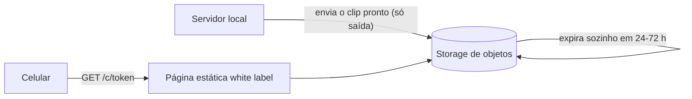

# 🏐 Highlight da Quadra

> Um totem com **um botão**. Fez uma jogada incrível no futevôlei ou no futebol? Corre lá, aperta, e os **últimos 30 segundos** viram um clip que você baixa no celular escaneando um QR code na TV.

Este documento resume o projeto, as decisões que tomamos e, principalmente, **por que** escolhemos cada coisa para manter a **superfície de ataque o menor possível**.

> **Status:** ideia validada no papel, MVP planejado para a quadra da igreja. Nada aqui foi testado em campo ainda. Valores e especificações são estimativas e precisam ser conferidos.

---

## Sumário

1. [A ideia em uma frase](#1-a-ideia-em-uma-frase)
2. [Como funciona](#2-como-funciona)
3. [Arquitetura do MVP](#3-arquitetura-do-mvp)
4. [Por que é seguro: superfície de ataque](#4-por-que-é-seguro-superfície-de-ataque)
5. [Decisões de segurança (e o motivo de cada uma)](#5-decisões-de-segurança-e-o-motivo-de-cada-uma)
6. [O que pode dar errado?](#6-o-que-pode-dar-errado)
7. [Equipamentos do MVP](#7-equipamentos-do-mvp)
8. [Docker: como organizar](#8-docker-como-organizar)
9. [Fase 2: baixar fora do Wi-Fi](#9-fase-2-baixar-fora-do-wi-fi)
10. [Privacidade e LGPD](#10-privacidade-e-lgpd)
11. [Negócio: pensar cedo, validar tarde](#11-negócio-pensar-cedo-validar-tarde)
12. [Roteiro (roadmap)](#12-roteiro-roadmap)
13. [O que estudar](#13-o-que-estudar)
14. [Como guiar a IA no código](#14-como-guiar-a-ia-no-código)
15. [Pontos em aberto](#15-pontos-em-aberto)

---

## 1. A ideia em uma frase

**Botão → clip dos últimos 30 s → QR code na TV → download no celular.**
Tudo rodando **localmente**, sem nuvem, sem conta e sem app.

Já existem produtos parecidos no mercado, o que mostra que a demanda existe. A maioria é voltada a padel, pickleball e tênis, e depende de nuvem ou assinatura. O diferencial deste projeto é ser **local, barato e com pouca superfície de ataque**.

---

## 2. Como funciona


Em palavras simples:

1. A câmera filma a quadra o tempo todo.
2. O servidor guarda só **os últimos 1 a 2 minutos** num "buffer circular" (como uma fita que regrava por cima de si mesma).
3. Quando alguém aperta o botão, o servidor **recorta os últimos 30 segundos** desse buffer e salva como um clip.
4. A TV mostra o QR code daquele clip.
5. O celular escaneia o QR, abre a página, assiste e baixa.

> 💡 **Por que é rápido?** O FFmpeg só **copia** o vídeo (`-c copy`), sem recodificar. É como fotocopiar um pedaço de fita em vez de regravá-la. Isso usa pouquíssimo processador e o clip fica pronto em segundos.

---

## 3. Arquitetura do MVP


| Peça | O que faz | Fica exposto? |
|---|---|---|
| **Câmera IP** | Envia o vídeo por RTSP | Não (senha trocada, sem internet) |
| **recorder** | FFmpeg, buffer, recebe o botão, gera o clip | Só o endpoint do botão, na rede interna |
| **Pasta de clips** | Guarda os MP4 temporários | Não diretamente |
| **web** | Serve a página e o vídeo por token | **Sim, é a única porta pública do local** |
| **TV (kiosk)** | Mostra o QR code | Não (página só em `127.0.0.1`) |
| **Botão (ESP32)** | Manda o sinal por Wi-Fi | Só fala com o servidor |

---

## 4. Por que é seguro: superfície de ataque

**Superfície de ataque** é tudo o que uma pessoa mal-intencionada consegue alcançar. Quanto menos portas, rotas e funções, menos coisas podem dar errado.


A regra de ouro do projeto: **o que não precisa estar acessível, não está.** O celular do usuário só consegue fazer uma coisa: pedir um vídeo por um link impossível de adivinhar.

> ⚠️ **Nenhum sistema é "inhackeável".** O objetivo é reduzir o que pode ser atacado e limitar o estrago caso algo falhe.

---

## 5. Decisões de segurança (e o motivo de cada uma)

| # | Decisão | Por quê |
|---|---|---|
| 1 | **O botão é físico (ESP32), não existe rota "criar clip" na internet.** | Quem não tem acesso ao botão não consegue disparar nada. |
| 2 | **O endpoint do botão exige um segredo longo e tem cooldown.** | Evita que alguém na rede dispare clips em sequência e lote o disco. |
| 3 | **O site só aceita `GET /c/<token>`.** Sem upload, sem login, sem painel, sem listagem de pastas. | Sem formulário e sem campo de texto, não há onde injetar nada. |
| 4 | **O token é aleatório e longo (`crypto.randomBytes`, 32+ caracteres).** | Ninguém adivinha o link de outro clip. |
| 5 | **Nunca servir arquivo pelo nome.** Um mapa `token → arquivo`, e token fora do padrão devolve 404. | Evita *path traversal* (alguém pedir `../../etc/passwd`). |
| 6 | **O FFmpeg é chamado com `spawn` e lista de argumentos, nunca `exec` com texto montado.** | Evita *injeção de comando*. |
| 7 | **Dois containers: `recorder` e `web`. A pasta de clips é somente leitura no `web`.** | Se o `web` for invadido, ele não consegue gravar nem acessar a câmera. |
| 8 | **Containers sem root, `read_only`, `cap_drop: ALL`, `no-new-privileges`.** | Menor privilégio possível dentro do container. |
| 9 | **Buffer na RAM (`tmpfs`).** | O vídeo contínuo nunca vai para o disco e some se o equipamento desligar. |
| 10 | **Clips expiram em 1 a 2 horas e o arquivo é apagado junto com o registro.** | Menos dados guardados, menos risco, disco nunca lota. |
| 11 | **Câmera isolada da internet, com senha trocada.** | O vazamento mais sensível seria ver a câmera ao vivo. |
| 12 | **Página da TV só em `127.0.0.1` e sem teclado ligado.** | Ninguém abre DevTools nem enxerga as rotas. |
| 13 | **Pi/notebook numa caixa trancada, só o botão acessível por fora.** | Segurança física também é segurança. |
| 14 | **Sem Fire Stick e sem Smart TV conectada à rede.** | Evita contas, anúncios e atualizações que não controlamos. |
| 15 | **Poucas dependências, com `npm audit`.** | Cada biblioteca é código de terceiros que pode ter falha. |
| 16 | **Sem nuvem no MVP.** | Sem servidor público, sem banco de dados, sem SQL para atacar. |

---

## 6. O que pode dar errado?

Do mais provável ao mais grave, e o que mitiga cada um:

| Risco | O que acontece | Mitigação |
|---|---|---|
| **Adivinharem links** | Alguém vê clips de outros | Token longo e aleatório, expiração curta |
| **Derrubarem o serviço (DoS)** | Site lento ou fora do ar | Limite de requisições |
| **Disco cheio** | Sistema para (nem precisa de hacker) | Expiração automática + limite de espaço |
| **Alguém dispara o botão pela rede** | Muitos clips seguidos | Segredo no endpoint + cooldown. *Nota:* no MVP o ESP32 usa o mesmo Wi-Fi dos celulares, então isso é um risco real e conhecido. |
| **Acesso à câmera** | Vídeo ao vivo vazado | Senha forte, câmera sem internet |
| **Invasão do servidor** | Usado para atacar a rede do local | Container sem privilégios, firewall, código mínimo |

**Cenário aceitável:** alguém assistir a alguns clips curtos de quadra.
**Cenário que queremos evitar a todo custo:** o servidor virar porta de entrada para os computadores do estabelecimento. Por isso o código é mínimo e o container, restrito.

---

## 7. Equipamentos do MVP

> Preços são aproximados e mudam; confira antes de comprar.

| Item | Observação | Custo aproximado |
|---|---|---|
| **Servidor** | Notebook velho (já tem Wi-Fi, Ethernet, HDMI e bateria que funciona como nobreak) ou Raspberry Pi 4/5 | R$ 0 (notebook) ou o preço do kit do Pi |
| **Câmera** | Modelo CA-1003 para teste, **se tiver RTSP**. Depois, uma câmera IP com RTSP/ONVIF aberto, H.264, PoE e IP66 | R$ 0 (a que já tem) para o teste |
| **Botão** | Botão arcade grande | ~R$ 15 a 30 |
| **Microcontrolador** | ESP32 (tem Wi-Fi) | ~R$ 40 a 60 |
| **Caixa do botão** | Caixa de passagem IP65 + adaptador USB de tomada | ~R$ 30 a 60 |
| **TV** | A que já existe no local, ligada por HDMI | R$ 0 |
| **Cabo HDMI** | Se a TV ficar longe, usar extensor HDMI | variável |
| **Rede** | Roteador do local, com IP fixo (reserva de DHCP) para o servidor | R$ 0 |

**Gasto novo estimado**, tendo notebook, TV e câmera: **R$ 100 a 200** (ESP32, botão, caixa, cabos).

### Cuidados com a câmera de teste (CA-1003)

- Confirmar se ela tem **RTSP/ONVIF**: `ffprobe rtsp://usuario:senha@IP:554/...`
- Se for Wi-Fi, ela fica na rede do local (não dá para isolar por cabo). Se possível, **bloquear o acesso dela à internet no roteador** e trocar a senha padrão.
- Câmera Wi-Fi é boa para protótipo, mas oscila em uso contínuo.

---

## 8. Docker: como organizar

Docker aqui **não é exagero** se usado no básico: o que roda no notebook de teste é igual ao que roda no servidor final. Nada de Kubernetes.

Exemplo **ilustrativo** do `docker-compose.yml` (ajustar na implementação):

```yaml
services:
  recorder:
    build: ./recorder
    user: "1000:1000"
    read_only: true
    cap_drop: [ALL]
    security_opt: ["no-new-privileges:true"]
    tmpfs:
      - /buffer:size=128m   # buffer circular na RAM
      - /tmp
    volumes:
      - clips:/clips
    ports:
      - "127.0.0.1:8082:8082"       # página da TV (só local)
      - "IP_INTERNO:8081:8081"      # endpoint do botão (só rede interna)
    restart: unless-stopped

  web:
    build: ./web
    user: "1000:1000"
    read_only: true
    cap_drop: [ALL]
    security_opt: ["no-new-privileges:true"]
    tmpfs:
      - /tmp
    volumes:
      - clips:/clips:ro             # somente leitura
    ports:
      - "8080:8080"                 # única porta para os celulares
    restart: unless-stopped

volumes:
  clips:
```

Coisas a **nunca** fazer: `--privileged`, montar o `docker.sock`, rodar como root.

### Pontos de atenção ao trocar de máquina

- **Notebook não tem GPIO.** Por isso o botão é um ESP32 por Wi-Fi. Para testar sem hardware, use um `curl` com o segredo.
- **Se for para um Raspberry Pi**, a imagem Docker precisa ser gerada para ARM (`docker buildx`).
- **Linux no servidor final** (Ubuntu Server ou Debian) e configurar a BIOS para religar sozinho quando a energia voltar.
- **Keyframes:** o corte com `-c copy` só acontece em quadros-chave. O intervalo deles na câmera define a precisão do corte. Testar.

### A TV (sem controle, sem superfície)

- Chromium em **modo kiosk** no próprio servidor, ligado por HDMI.
- A página só mostra o logo, o QR code e uma instrução. Quando um clip novo fica pronto, ela se atualiza sozinha (Server-Sent Events).
- Sem teclado, sem mouse e sem touch, não há como abrir DevTools.
- Mostrar o aviso: *"Conecte no Wi-Fi do local para baixar"*.
- Fontes e imagens **locais** (sem CDN), para funcionar sem internet.
- Página **white label**: cores em variáveis CSS, logo e textos trocáveis por cliente, com um discreto *"Desenvolvido por …"*.

---

## 9. Fase 2: baixar fora do Wi-Fi

Hoje, o celular precisa estar no Wi-Fi do local. Para baixar de qualquer lugar, o clip precisa ir para fora. Mantendo a ideia de **pouca superfície**:



**Opção recomendada: bucket de storage de objetos** (por exemplo Cloudflare R2, Backblaze B2 ou S3):

- O servidor local envia o clip com uma **credencial que só permite gravar**.
- Uma **regra de ciclo de vida** apaga os clips sozinha após algumas horas.
- O QR aponta para um link com token longo. Sem VPS, sem banco, sem SQL.

**Se usar VPS:**

- Guardar o **arquivo em disco** e só os **metadados** no banco (token, nome do arquivo, validade). **Não guardar o vídeo dentro do banco.**
- Consultas **parametrizadas** sempre. SQL injection não é "de leve": pode dar acesso a outras tabelas.
- Expirar com **job agendado** (cron). Trigger de banco não dispara por tempo, e é preciso apagar o arquivo junto com o registro.
- O endpoint de upload é o ponto crítico: chave por equipamento, limite de tamanho, limite de frequência e só `.mp4`.
- **Sem galeria pública de clips**, só links individuais. Vídeos de pessoas (incluindo crianças) não devem ser navegáveis por desconhecidos.
- Deixar o local guardar o clip e reenviar se a internet cair.

> Fazer isso **depois** do MVP local funcionar. Uma superfície nova de cada vez.

---

## 10. Privacidade e LGPD

Filmar pessoas, incluindo menores, tem responsabilidade:

- Placa visível avisando que a quadra é filmada e que o botão gera um clip.
- Política de privacidade simples e termos de uso.
- Retenção curta e apagamento automático dos clips.
- Atenção redobrada com crianças e adolescentes.
- Antes de instalar em cliente pagante, **consultar alguém que entenda de LGPD**. Este documento não é aconselhamento jurídico.

---

## 11. Negócio: pensar cedo, validar tarde

**O MVP da igreja é para aprender e validar.** Sem licença, sem cobrança, sem trava.

Se o piloto der certo, ideias para depois (todas a validar com clientes reais):

- **Referência de mercado:** um concorrente cobra por quadra por mês, em euro, num mercado muito mais caro que o nosso. O preço aqui precisa ser conversado com donos de quadra reais.
- **Equipamento:** preferir **comodato/locação** ou **venda do hardware + mensalidade pelo serviço**, em vez de entregar "tudo pronto e do cliente". Contrato deve prever recolhimento, proibição de cópia e suspensão por inadimplência. Revisar com advogado.
- **O que segura o cliente de verdade:** instalação, suporte rápido, relacionamento local, hardware robusto, e o sistema ajudar o dono a ganhar dinheiro (patrocínio, mais movimento). Proteção técnica contra cópia ajuda pouco, já que o código por si só é copiável.
- **Licença remota:** (heartbeat assinado na VPS) fica para quando houver cliente pagante. Dificulta adulteração, mas **não prova** adulteração, porque o cliente tem a máquina na mão.
- **Patrocínio:** marca d'água ou vinheta no clip (exige recodificar, então medir o desempenho antes).

---

## 12. Roteiro (roadmap)

| Fase | Objetivo | Entrega |
|---|---|---|
| **0** | Aprender FFmpeg no terminal | Gravar RTSP em segmentos e cortar um clip na mão |
| **1** | Script que grava e corta | Buffer + comando "cortar últimos 30 s" |
| **2** | Servidor web mínimo | `GET /c/<token>` servindo o MP4, com `Range`, token e expiração |
| **3** | Botão e TV | ESP32 com segredo, página da TV com QR atualizando sozinha |
| **4** | Docker | Dois containers com as restrições da seção 8 |
| **5** | **Piloto na quadra da igreja** | Testar sol, Wi-Fi, areia, gente apertando o botão sem parar |
| **6** | Medir e ajustar | CPU, RAM, disco e tempo do clique até o QR |
| **7** | Fase 2 (opcional) | Upload para storage, link fora do Wi-Fi |

---

## 13. O que estudar

Na ordem em que serão usadas:

1. **FFmpeg e vídeo:** RTSP, segmentos, keyframes, `-c copy`, `-movflags +faststart`.
2. **Redes básicas:** IP, DHCP, portas, firewall, LAN.
3. **Node.js:** streams, `fs`, `child_process.spawn`, servidor HTTP, cabeçalho `Range`.
4. **Linux:** usuários, permissões, systemd, logs, tmpfs.
5. **Docker e Compose:** Dockerfile, volumes, usuário não-root, healthcheck.
6. **Segurança:** OWASP Top 10 (path traversal, injeção de comando, DoS), `crypto.randomBytes`, menor privilégio, modelo de ameaça simples.
7. **Ferramentas de teste:** `ffprobe`, `curl`, `nmap`, Wireshark.
8. **ESP32:** Wi-Fi e requisições HTTP simples.

---

## 14. Como guiar a IA no código

Cole este bloco no início de cada conversa de desenvolvimento:

```text
REGRAS DO PROJETO (obrigatórias)
- Servidor web só aceita GET /c/<token>. Sem upload, sem login, sem listagem.
- Token: crypto.randomBytes, mínimo 32 caracteres. Se não bater o padrão, responder 404.
- Nunca servir arquivo por nome vindo do cliente. Usar mapa token -> arquivo.
- FFmpeg sempre via child_process.spawn com array de argumentos. Nunca exec com string.
- Nenhum dado vindo da rede pode chegar em comando de shell ou caminho de arquivo.
- Containers sem root, read_only, cap_drop ALL, no-new-privileges.
- A pasta de clips é somente leitura no container web.
- Poucas dependências. Justificar cada uma. Confirmar que existe e é mantida.
- Clips expiram em 1-2 h (apagar registro E arquivo).
- Código simples e comentado, para eu aprender lendo.
```

Boas práticas ao trabalhar com IA:

- Peça **em pedaços pequenos** e leia cada mudança. Não aceite código que você não entende.
- Peça uma **revisão adversarial**: *"Aja como pentester e tente quebrar este código."*
- Transforme segurança em **teste**: tentar `../../etc/passwd`, token inválido, muitas requisições, clip expirado.
- **Confira cada dependência.** A IA às vezes inventa pacotes ou sugere bibliotecas abandonadas.
- **Meça antes de otimizar.**

---

## 15. Pontos em aberto

- [ ] A CA-1003 tem RTSP/ONVIF? Qual o caminho do stream?
- [ ] O roteador da igreja tem **isolamento de clientes** no Wi-Fi? (Se tiver, o celular não alcança o servidor.)
- [ ] O sinal de Wi-Fi chega bem no totem?
- [ ] No Android, o Wi-Fi sem internet às vezes cai para o 4G. Testar em vários celulares. (O Wi-Fi da igreja deve ter internet.)
- [ ] Intervalo de keyframes da câmera: qual a precisão do corte?
- [ ] HTTP sem HTTPS na rede local: aceitável para o piloto, ciente de que quem está na mesma rede pode ver o tráfego.
- [ ] Marca d'água: quanto pesa recodificar no equipamento escolhido?
- [ ] Definir nome do projeto e identidade visual da página white label.
- [ ] Texto da placa de aviso (LGPD) e política de privacidade.

---

*Documento vivo: atualize conforme o projeto avançar e conforme os testes derrubarem (ou confirmarem) as suposições.*
