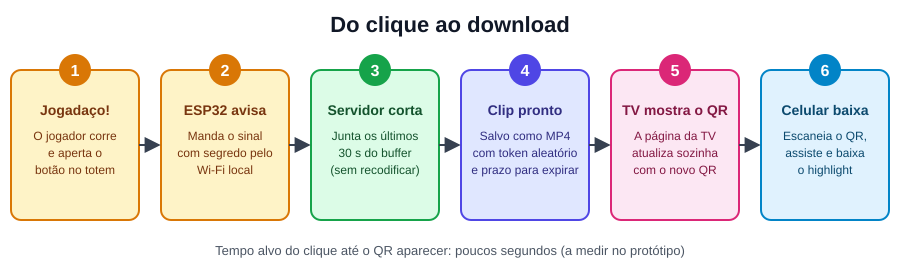
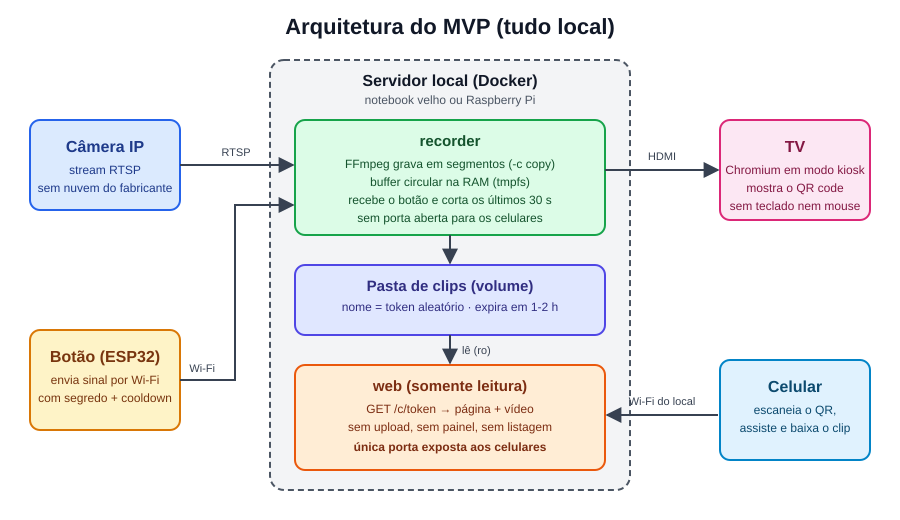
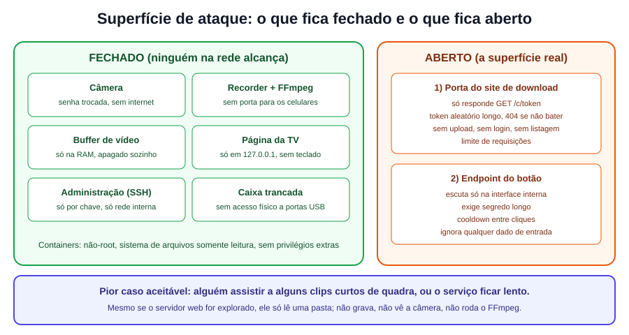
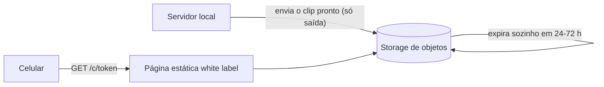

# Highlight da Quadra

Um totem com um botão para quadras de futevôlei e futebol. Fiz uma jogada boa, corro até o totem, aperto o botão e os **últimos 30 segundos** viram um clip. O QR code aparece na TV do local, eu escaneio e baixo o vídeo no celular.

Estou construindo tudo para rodar **localmente**: sem nuvem, sem conta e sem app. Este README explica como o sistema funciona e, principalmente, as decisões que tomei para manter a **superfície de ataque o menor possível**.

> **Status:** em desenvolvimento. O primeiro teste em campo será na quadra da igreja. Os valores de custo abaixo são estimativas minhas.
> O nome "Highlight da Quadra" é provisório.

## Sumário

1. [Como funciona](#1-como-funciona)
2. [Arquitetura](#2-arquitetura)
3. [Superfície de ataque](#3-superfície-de-ataque)
4. [Decisões de segurança](#4-decisões-de-segurança)
5. [Riscos e como mitigo](#5-riscos-e-como-mitigo)
6. [Equipamentos](#6-equipamentos)
7. [Docker](#7-docker)
8. [A TV](#8-a-tv)
9. [Fase 2: baixar fora do Wi-Fi](#9-fase-2-baixar-fora-do-wi-fi)
10. [Privacidade e LGPD](#10-privacidade-e-lgpd)
11. [Negócio](#11-negócio)
12. [Roadmap](#12-roadmap)
13. [O que estou estudando](#13-o-que-estou-estudando)
14. [Como uso IA no desenvolvimento](#14-como-uso-ia-no-desenvolvimento)
15. [O que ainda preciso validar](#15-o-que-ainda-preciso-validar)

---

## 1. Como funciona



1. A câmera filma a quadra o tempo todo.
2. O servidor guarda só os últimos 1 a 2 minutos num buffer circular, que regrava por cima de si mesmo.
3. Quando aperto o botão, o servidor recorta os últimos 30 segundos desse buffer e salva um clip.
4. A TV mostra o QR code daquele clip.
5. Escaneio o QR, assisto e baixo no celular.

O FFmpeg só **copia** o vídeo (`-c copy`), sem recodificar. Por isso o clip fica pronto em poucos segundos e o processador quase não é usado.

## 2. Arquitetura



| Peça | O que faz | Fica exposto? |
|---|---|---|
| Câmera IP | Envia o vídeo por RTSP | Não (senha trocada, sem internet) |
| `recorder` | FFmpeg, buffer, recebe o botão, gera o clip | Só o endpoint do botão, na rede interna |
| Pasta de clips | Guarda os MP4 temporários | Não diretamente |
| `web` | Serve a página e o vídeo por token | Sim, é a única porta aberta aos celulares |
| TV (kiosk) | Mostra o QR code | Não (página só em `127.0.0.1`) |
| Botão (ESP32) | Envia o sinal por Wi-Fi | Só fala com o servidor |

## 3. Superfície de ataque

Superfície de ataque é tudo que alguém mal-intencionado consegue alcançar. Meu critério é simples: se algo não precisa estar acessível, não fica acessível. O celular de quem usa só consegue pedir um vídeo por um link impossível de adivinhar.



Não existe sistema inhackeável. O que busco é reduzir o que pode ser atacado e limitar o estrago caso algo falhe.

## 4. Decisões de segurança

| # | O que fiz | Por quê |
|---|---|---|
| 1 | O botão é físico (ESP32). Não existe rota "criar clip" aberta na rede. | Quem não tem acesso ao botão não dispara nada. |
| 2 | O endpoint do botão exige um segredo longo e tem cooldown. | Evita clips em sequência e disco cheio. |
| 3 | O site só aceita `GET /c/<token>`. Sem upload, login, painel nem listagem de pastas. | Sem formulário e sem campo de texto, não há onde injetar nada. |
| 4 | O token é gerado com `crypto.randomBytes`, com 32+ caracteres. | Ninguém adivinha o link de outro clip. |
| 5 | Nunca sirvo arquivo pelo nome. Uso um mapa `token → arquivo` e devolvo 404 se o token não bater com o padrão. | Evita path traversal (`../../etc/passwd`). |
| 6 | Chamo o FFmpeg com `spawn` e array de argumentos, nunca `exec` com texto montado. | Evita injeção de comando. |
| 7 | Separei em dois containers, `recorder` e `web`. A pasta de clips é somente leitura no `web`. | Se o `web` for invadido, ele não grava nem acessa a câmera. |
| 8 | Containers sem root, com `read_only`, `cap_drop: ALL` e `no-new-privileges`. | Menor privilégio possível. |
| 9 | O buffer fica na RAM (`tmpfs`). | O vídeo contínuo não vai para o disco e some se desligar. |
| 10 | Os clips expiram em 1 a 2 horas, e apago o arquivo junto com o registro. | Menos dado guardado e disco que não lota. |
| 11 | A câmera fica sem acesso à internet e com senha trocada. | O vazamento mais sensível seria a câmera ao vivo. |
| 12 | A página da TV só existe em `127.0.0.1` e a TV não tem teclado nem mouse. | Ninguém abre DevTools nem vê as rotas. |
| 13 | O servidor fica numa caixa trancada. Só o botão fica acessível por fora. | Segurança física também conta. |
| 14 | Não uso Fire Stick nem Smart TV conectada à rede. | Evito contas, anúncios e atualizações que não controlo. |
| 15 | Uso poucas dependências e rodo `npm audit`. | Cada biblioteca é código de terceiros. |
| 16 | No MVP não uso nuvem. | Sem servidor público, sem banco e sem SQL para atacar. |

## 5. Riscos e como mitigo

| Risco | O que acontece | Como mitigo |
|---|---|---|
| Adivinharem links | Alguém vê clips de outros | Token longo e aleatório, expiração curta |
| Derrubarem o serviço (DoS) | Site lento ou fora do ar | Limite de requisições |
| Disco cheio | O sistema para | Expiração automática e limite de espaço |
| Disparo do botão pela rede | Muitos clips seguidos | Segredo no endpoint e cooldown |
| Acesso à câmera | Vídeo ao vivo vazado | Senha forte, câmera sem internet |
| Invasão do servidor | Usado para atacar a rede do local | Container sem privilégios, firewall, código mínimo |

No MVP o ESP32 usa o mesmo Wi-Fi dos celulares, então o disparo do botão pela rede é um risco que conheço e aceito, reduzido pelo segredo e pelo cooldown.

O pior resultado que aceito é alguém assistir a alguns clips curtos de quadra. O que quero evitar a todo custo é o servidor virar porta de entrada para os computadores do estabelecimento, e por isso mantenho o código mínimo e o container restrito.

## 6. Equipamentos

Os custos são aproximados e variam.

| Item | Observação | Custo aproximado |
|---|---|---|
| Servidor | Notebook velho (tem Wi-Fi, Ethernet, HDMI e bateria que serve de nobreak) ou Raspberry Pi 4/5 | R$ 0 com o notebook |
| Câmera | A CA-1003 para testar, se tiver RTSP. Depois, uma câmera IP com RTSP/ONVIF aberto, H.264, PoE e IP66 | R$ 0 para o teste |
| Botão | Botão arcade grande | R$ 15 a 30 |
| Microcontrolador | ESP32 (já tem Wi-Fi) | R$ 40 a 60 |
| Caixa do botão | Caixa de passagem IP65 e adaptador USB de tomada | R$ 30 a 60 |
| TV | A que já existe no local, por HDMI | R$ 0 |
| Rede | Roteador do local, com IP fixo para o servidor (reserva de DHCP) | R$ 0 |

Com notebook, TV e câmera já em mãos, o gasto novo fica em R$ 100 a 200.

Para a câmera de teste (CA-1003), confirmo o RTSP com `ffprobe rtsp://usuario:senha@IP:554/...`. Como ela é Wi-Fi, fica na rede do local, então troco a senha padrão e, se der, bloqueio o acesso dela à internet no roteador. Câmera Wi-Fi serve para protótipo, mas oscila em uso contínuo.

## 7. Docker

Uso o Docker no básico, para que o ambiente do notebook de teste seja igual ao do servidor final. Sem Kubernetes nem orquestrador.

Versão simplificada do `docker-compose.yml`:

```yaml
services:
  recorder:
    build: ./recorder
    user: "1000:1000"
    read_only: true
    cap_drop: [ALL]
    security_opt: ["no-new-privileges:true"]
    tmpfs:
      - /buffer:size=128m   # buffer circular na RAM
      - /tmp
    volumes:
      - clips:/clips
    ports:
      - "127.0.0.1:8082:8082"       # página da TV (só local)
      - "IP_INTERNO:8081:8081"      # endpoint do botão (só rede interna)
    restart: unless-stopped

  web:
    build: ./web
    user: "1000:1000"
    read_only: true
    cap_drop: [ALL]
    security_opt: ["no-new-privileges:true"]
    tmpfs:
      - /tmp
    volumes:
      - clips:/clips:ro             # somente leitura
    ports:
      - "8080:8080"                 # única porta para os celulares
    restart: unless-stopped

volumes:
  clips:
```

Nunca uso `--privileged`, nunca monto o `docker.sock` e nunca rodo como root.

Notas de ambiente:

- Notebook não tem GPIO, por isso o botão é um ESP32 por Wi-Fi. Para testar sem hardware, uso um `curl` com o segredo.
- Se migrar para Raspberry Pi, preciso gerar a imagem para ARM (`docker buildx`).
- No servidor final uso Linux (Ubuntu Server ou Debian) e configuro a BIOS para religar sozinho quando a energia voltar.
- O corte com `-c copy` só acontece em quadros-chave, então o intervalo deles na câmera define a precisão do clip.

## 8. A TV

- O Chromium roda em modo kiosk no próprio servidor, ligado à TV por HDMI.
- A página mostra só o logo, o QR code e uma instrução. Quando um clip novo fica pronto, ela se atualiza sozinha (Server-Sent Events).
- Sem teclado, mouse nem touch, não há como abrir DevTools.
- Exibo o aviso "Conecte no Wi-Fi do local para baixar".
- Fontes e imagens são locais, sem CDN, para funcionar sem internet.
- A página é white label: cores em variáveis CSS, logo e textos trocáveis por cliente, com um discreto "Desenvolvido por" com meu nome.

## 9. Fase 2: baixar fora do Wi-Fi

Hoje o celular precisa estar no Wi-Fi do local. Para baixar de qualquer lugar, o clip precisa sair do servidor local. Pretendo manter a mesma ideia de pouca superfície:



Minha opção preferida é um bucket de storage de objetos (Cloudflare R2, Backblaze B2 ou S3):

- O servidor local envia o clip com uma credencial que só permite gravar.
- Uma regra de ciclo de vida apaga os clips sozinha depois de algumas horas.
- O QR aponta para um link com token longo. Sem VPS, sem banco e sem SQL.

Se eu optar por VPS, as regras são:

- Guardo o arquivo em disco e só os metadados no banco (token, nome do arquivo, validade). O vídeo nunca vai dentro do banco.
- Só uso consultas parametrizadas. SQL injection não é "de leve": pode dar acesso a outras tabelas.
- Expiro com um job agendado (cron), porque trigger de banco não dispara por tempo. O job apaga o arquivo junto com o registro.
- O endpoint de upload é o ponto crítico: chave por equipamento, limite de tamanho, limite de frequência e só `.mp4`.
- Sem galeria pública. Só links individuais, porque vídeos de pessoas (incluindo crianças) não devem ficar navegáveis por desconhecidos.
- O servidor local guarda o clip e reenvia se a internet cair.

Só começo isso depois que a versão local estiver funcionando.

## 10. Privacidade e LGPD

Eu filmo pessoas, incluindo menores, então:

- Vou colocar uma placa visível avisando que a quadra é filmada e que o botão gera um clip.
- Vou escrever uma política de privacidade simples e termos de uso.
- Mantenho a retenção curta e o apagamento automático.
- Tenho atenção redobrada com crianças e adolescentes.
- Antes de instalar em cliente pagante, vou consultar alguém que entenda de LGPD.

## 11. Negócio

O MVP da igreja é para aprender e validar, sem cobrança e sem licença. Se funcionar, penso nisto:

- Já existem produtos parecidos, em geral voltados a padel e pickleball e dependentes de nuvem ou assinatura. Meu diferencial é ser local, barato e com pouca superfície de ataque.
- O preço eu só defino conversando com donos de quadra.
- Prefiro comodato/locação, ou venda do hardware com mensalidade pelo serviço, em vez de entregar tudo pronto e do cliente. O contrato precisa prever recolhimento, proibição de cópia e suspensão por inadimplência, e vou revisar com um advogado.
- O que segura o cliente é instalação, suporte rápido, relacionamento local e o sistema ajudar o dono a ganhar dinheiro (patrocínio, mais movimento). Proteção contra cópia ajuda pouco, já que o código em si é copiável.
- Licença remota (heartbeat assinado) fica para quando houver cliente pagante. Ela dificulta adulteração, mas não a prova.
- Marca d'água de patrocinador exige recodificar o vídeo, então vou medir o desempenho antes.

## 12. Roadmap

| Fase | Objetivo | Entrega |
|---|---|---|
| 0 | Aprender FFmpeg no terminal | Gravar RTSP em segmentos e cortar um clip na mão |
| 1 | Script que grava e corta | Buffer e comando "cortar últimos 30 s" |
| 2 | Servidor web mínimo | `GET /c/<token>` servindo o MP4, com `Range`, token e expiração |
| 3 | Botão e TV | ESP32 com segredo e página da TV com QR atualizando sozinha |
| 4 | Docker | Dois containers com as restrições da seção 7 |
| 5 | Piloto na quadra da igreja | Testar sol, Wi-Fi, areia e gente apertando o botão sem parar |
| 6 | Medir e ajustar | CPU, RAM, disco e tempo do clique até o QR |
| 7 | Fase 2 (opcional) | Upload para storage e link fora do Wi-Fi |

## 13. O que estou estudando

Na ordem em que uso:

1. FFmpeg e vídeo: RTSP, segmentos, keyframes, `-c copy`, `-movflags +faststart`.
2. Redes básicas: IP, DHCP, portas, firewall, LAN.
3. Node.js: streams, `fs`, `child_process.spawn`, servidor HTTP, cabeçalho `Range`.
4. Linux: usuários, permissões, systemd, logs, tmpfs.
5. Docker e Compose: Dockerfile, volumes, usuário não-root, healthcheck.
6. Segurança: OWASP Top 10, `crypto.randomBytes`, menor privilégio e modelo de ameaça simples.
7. Ferramentas de teste: `ffprobe`, `curl`, `nmap`, Wireshark.
8. ESP32: Wi-Fi e requisições HTTP simples.

## 14. Como uso IA no desenvolvimento

Uso IA para me ajudar a escrever o código, mas conduzo com regras fixas. No início de cada conversa colo este bloco:

```text
REGRAS DO PROJETO (obrigatórias)
- Servidor web só aceita GET /c/<token>. Sem upload, sem login, sem listagem.
- Token: crypto.randomBytes, mínimo 32 caracteres. Se não bater o padrão, responder 404.
- Nunca servir arquivo por nome vindo do cliente. Usar mapa token -> arquivo.
- FFmpeg sempre via child_process.spawn com array de argumentos. Nunca exec com string.
- Nenhum dado vindo da rede pode chegar em comando de shell ou caminho de arquivo.
- Containers sem root, read_only, cap_drop ALL, no-new-privileges.
- A pasta de clips é somente leitura no container web.
- Poucas dependências. Justificar cada uma. Confirmar que existe e é mantida.
- Clips expiram em 1-2 h (apagar registro E arquivo).
- Código simples e comentado, para eu aprender lendo.
```

Além disso:

- Peço o código em pedaços pequenos e leio cada mudança. Não aceito o que não entendo.
- Peço revisão adversarial: "aja como pentester e tente quebrar este código".
- Transformo segurança em teste: `../../etc/passwd`, token inválido, muitas requisições e clip expirado.
- Confiro cada dependência, porque a IA às vezes inventa pacotes ou sugere bibliotecas abandonadas.
- Meço antes de otimizar.

## 15. O que ainda preciso validar

- [ ] A CA-1003 tem RTSP/ONVIF? Qual o caminho do stream?
- [ ] O roteador da igreja tem isolamento de clientes no Wi-Fi? Se tiver, o celular não alcança o servidor.
- [ ] O sinal de Wi-Fi chega bem no totem?
- [ ] No Android, o Wi-Fi sem internet às vezes cai para o 4G. Testar em vários celulares, com o Wi-Fi da igreja tendo internet.
- [ ] Qual o intervalo de keyframes da câmera e que precisão de corte ele dá?
- [ ] HTTP sem HTTPS na rede local: aceito no piloto, ciente de que quem está na mesma rede pode ver o tráfego.
- [ ] Quanto pesa recodificar para a marca d'água no equipamento escolhido?
- [ ] Definir o nome do projeto e a identidade visual da página white label.
- [ ] Escrever o texto da placa de aviso e a política de privacidade.
